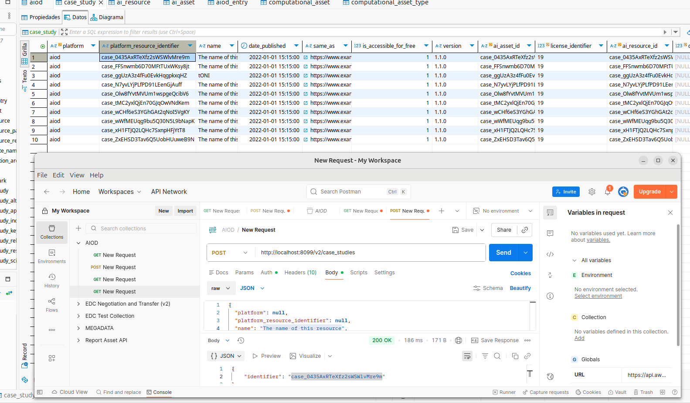

# This document is an extension of the README with detailed test cases

## TLS connection test (#32) — ✅

Debezium supports TLS encryption for Kafka connections.

Deployed branch `main` with TLS enabled on https://kf-aiod-dev.iti.es (primary node).

Steps performed:

1. Run `generate_kafka_tls.sh` on the primary node using `PRIMARY_PUB_IP` as the server name (here `kf-aiod-dev.iti.es`).

2. In the primary `docker-compose` configuration, add these environment variables to the `db-kafka` service so the broker picks up TLS artifacts:

   - `KAFKA_SSL_KEYSTORE_FILENAME: kafka.server.keystore.p12`
   - `KAFKA_SSL_KEYSTORE_CREDENTIALS: kafka_keystore_creds`
   - `KAFKA_SSL_KEY_CREDENTIALS: kafka_key_creds`
   - `KAFKA_SSL_TRUSTSTORE_FILENAME: kafka.server.truststore.p12`
   - `KAFKA_SSL_TRUSTSTORE_CREDENTIALS: kafka_truststore_creds`

3. Copy the files from `secondary/secrets/` to the secondary VM (for example with `scp`) into `mysql-debezium-poc/secondary/secrets/`.

4. Ensure `KAFKA_ADVERTISED_LISTENERS` advertises the public address/port. In our POC we forwarded host port `50010` to container `9093`; the advertised listeners looked like:
   `PLAINTEXT://kafka:9092,SSL://${PRIMARY_PUB_IP}:9093`

## Delete rows (#34) — ✅

Deletes on supported tables work out of the box: change events are published to Kafka and consumed by the sink connector.

## Update rows (#34) — ✅

Updates on supported tables work out of the box: change events are published to Kafka and consumed by the sink connector.

## DDL changes (#34) — ✅

Schema/table changes (create/alter/drop) are handled when Debezium is configured to publish schema changes:

- `database.history.kafka.topic`: `schema-changes.DB_NAME`
- `include.schema.changes`: `true`

When a table is altered on the primary node, Debezium emits a schema-change event and the secondary will receive that change once the event is published.

Table selection is controlled by the connector property:

- `table.include.list`: `test_db.*`

Note: creating, dropping or renaming tables may require Debezium to create or update connector configuration; in some cases secondary nodes need a restart to pick up the new connector.

## Secondary failover and resynchronization (#34) — ✅

Test procedure:

1. Stop or disconnect the secondary node (simulate failover).
2. Continue writes (INSERT/UPDATE/DELETE) on the primary.
3. Restart the secondary node and the Kafka consumer.
4. Allow Debezium/Kafka to replay missed events.

Result: the secondary recovered missed events. By default Kafka uses `cleanup.policy=delete` and `retention.ms=604800000` (7 days).

Considerations:

- To retain compacted state instead of time-based deletion, set `cleanup.policy=compact` so the latest value per key is retained indefinitely (useful for long-term resynchronization).

## Extend the PoC to the AiOD REST API Synchronization (#33) — ✅

The goal of this task was to:

1. Generate the Debezium Connect configuration (as defined in the previous step).
Automate the generation of Debezium source table configurations, supporting external settings for include/exclude tables, data-type conversions, and any additional rules required for a flexible and maintainable CDC setup.

   This has been achieved by changing the following config files:
      - primary/scripts/register_mysql_connector.sh:  DATABASE="${DATABASE:-aiod}"
                                                      TABLES="${TABLES:-aiod.*}"
                                                      HISTORY_TOPIC="${HISTORY_TOPIC:-schema-changes.aiod}"
      - primary/debezium-source.json:     "database.server.name": "aiod",
                                          "database.include.list": "aiod",
                                          "database.history.kafka.topic": "schema-changes.aiod"
      - secondary/jbdc-sink.json:     "topics.regex": "primary\\.aiod\\..*",
                                       "connection.url": "jdbc:mysql://host.docker.internal:3307/aiod?sessionVariables=foreign_key_checks=0",
Primary node will publish on kafka all changes made on all tables:
                                       ai4europe-worker-1:~$  docker exec -i db-kafka bash -lc 'kafka-topics --bootstrap-server kafka:9092 --list'
                                       __consumer_offsets
                                       dbz_config
                                       dbz_offsets
                                       dbz_statuses
                                       primary
                                       primary.aiod.address
                                       primary.aiod.ai_asset
                                       primary.aiod.ai_resource
                                       primary.aiod.aiod_entry
                                       primary.aiod.alternate_name
                                       primary.aiod.application_area
                                       primary.aiod.bookmark
                                       primary.aiod.case_study
                                       primary.aiod.case_study_alternate_name_link
                                       primary.aiod.case_study_application_area_link
                                       primary.aiod.case_study_industrial_sector_link
                                       primary.aiod.case_study_keyword_link
                                       primary.aiod.case_study_relevant_link_link
                                       primary.aiod.case_study_research_area_link
                                       primary.aiod.case_study_scientific_domain_link
                                       primary.aiod.dataset
                                       primary.aiod.dataset_alternate_name_link
                                       primary.aiod.dataset_application_area_link
                                       primary.aiod.dataset_industrial_sector_link
                                       primary.aiod.dataset_keyword_link
                                       primary.aiod.dataset_relevant_link_link
                                       primary.aiod.dataset_research_area_link
                                       primary.aiod.dataset_scientific_domain_link
                                       primary.aiod.dataset_size
                                       primary.aiod.distribution_dataset
                                       primary.aiod.experiment
                                       primary.aiod.experiment_industrial_sector_link
                                       primary.aiod.geo
                                       primary.aiod.industrial_sector
                                       primary.aiod.keyword
                                       primary.aiod.license
                                       primary.aiod.location
                                       primary.aiod.news_category
                                       primary.aiod.note_dataset
                                       primary.aiod.permission
                                       primary.aiod.platform
                                       primary.aiod.publication_type
                                       primary.aiod.relevant_link
                                       primary.aiod.research_area
                                       primary.aiod.scientific_domain
                                       primary.aiod.text
                                       primary.aiod.user
                                       schema-changes.aiod
                                       sink_config
                                       sink_offsets
                                       sink_status
This is mandatory as each asset has several foreign keys on other tables, trying to write only on case_studies for example is not possible as foreign keys restrictions will fail:
case_study_ibfk_1 platform
case_study_ibfk_2 ai_asset
case_study_ibfk_3 license
case_study_ibfk_4 ai_resource
case_study_ibfk_5 text
case_study_ibfk_6 aiod_entry

When an asset is created, several other tables are affected, so all tables on the database should be tracked trough the kafka topics. The secondary node will then read all the kafka topics and syncronize the new data.

2. Configure the synchronisation project so it points to the REST API’s MySQL DB.

The configuration on this branch is aiming for a deploy of the REST API and primary node on the worker https://kf-aiod-dev.iti.es/, and the secondary node on local.

3. Validate that Debezium correctly captures changes and synchronizes data across all nodes.
Using the endpoint /v2/case_studies, several cases studies have been created trough POSTMAN on the primary node and those were succesfully replicated on the secondary node.

localhost:8099 reffers to a port forwarding from local to port 8099 trough SSH where the AIOD-api is deployed, as a public adress is not available.

It was neccessary to do a transformation of datetime fields on the secondary connector configuration:

    "transforms": "unwrap,route,convertTimestamp,convertCreatedAt,convertDateDeleted,convertDateModified,convertDateCreated",
    "transforms.unwrap.type": "io.debezium.transforms.ExtractNewRecordState",
    "transforms.unwrap.drop.tombstones": "false",
    "transforms.route.type": "org.apache.kafka.connect.transforms.RegexRouter",
    "transforms.route.regex": "^primary\\.aiod\\.(.*)$",
    "transforms.route.replacement": "$1",
    "transforms.convertTimestamp.type": "org.apache.kafka.connect.transforms.TimestampConverter$Value",
    "transforms.convertTimestamp.field": "date_published",
    "transforms.convertTimestamp.target.type": "string",
    "transforms.convertTimestamp.format": "yyyy-MM-dd HH:mm:ss",
    "transforms.convertCreatedAt.type": "org.apache.kafka.connect.transforms.TimestampConverter$Value",
    "transforms.convertCreatedAt.field": "created_at",
    "transforms.convertCreatedAt.target.type": "string",
    "transforms.convertCreatedAt.format": "yyyy-MM-dd HH:mm:ss",
    "transforms.convertDateDeleted.type": "org.apache.kafka.connect.transforms.TimestampConverter$Value",
    "transforms.convertDateDeleted.field": "date_deleted",
    "transforms.convertDateDeleted.target.type": "string",
    "transforms.convertDateDeleted.format": "yyyy-MM-dd HH:mm:ss",
    "transforms.convertDateModified.type": "org.apache.kafka.connect.transforms.TimestampConverter$Value",
    "transforms.convertDateModified.field": "date_modified",
    "transforms.convertDateModified.target.type": "string",
    "transforms.convertDateModified.format": "yyyy-MM-dd HH:mm:ss",
    "transforms.convertDateCreated.type": "org.apache.kafka.connect.transforms.TimestampConverter$Value",
    "transforms.convertDateCreated.field": "date_created",
    "transforms.convertDateCreated.target.type": "string",
    "transforms.convertDateCreated.format": "yyyy-MM-dd HH:mm:ss",
